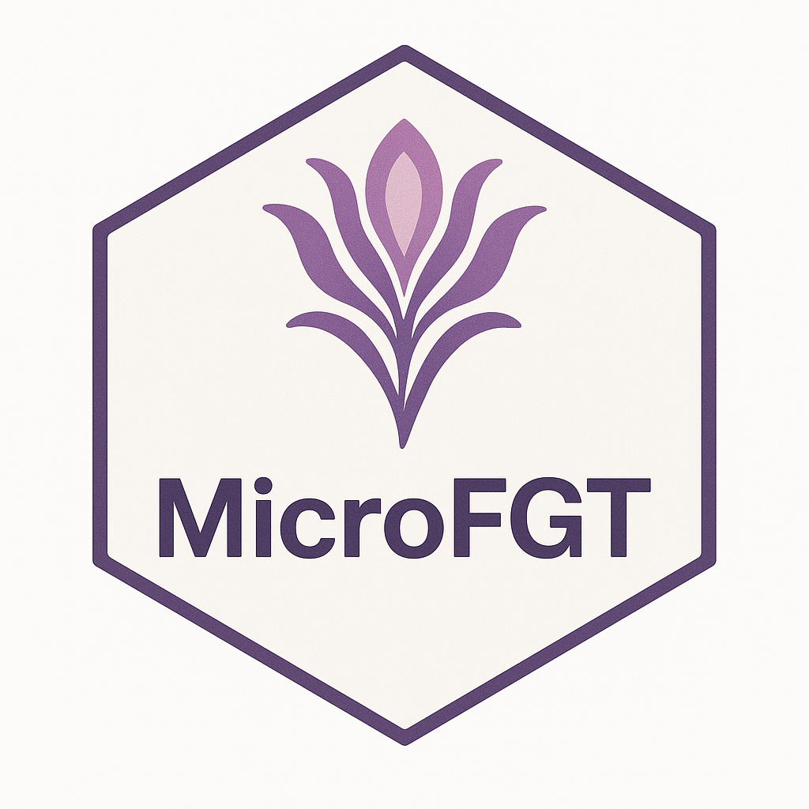

# microFGT: Comprehensive Analysis of Female Genital Tract Microbiome Data



<!-- badges: start -->
[](https://github.com/shandley/microFGT/actions)
[](https://codecov.io/gh/shandley/microFGT?branch=main)
[](https://lifecycle.r-lib.org/articles/stages.html#experimental)
[](https://opensource.org/licenses/MIT)
<!-- badges: end -->

## Overview

microFGT is an integrated R package for comprehensive analysis of female genital tract (FGT) microbiome data. This package provides specialized tools for microbiome analysis within a cohesive framework that handles both amplicon and metagenomic sequencing data from various platforms and analytical pipelines.

> 🚧 **BETA STAGE SOFTWARE**: This package is in active development. Core functionality is stable, but APIs may undergo refinement.

## Features

- **Compositional Architecture**:
  - S4 class design with modern compositional pattern
  - Enhanced data encapsulation and integrity
  - Comprehensive accessor methods
  - Robust transformation capabilities
- **Platform Integration**:
  - Native support for speciateIT, VALENCIA, and VIRGO outputs
  - Standardized import/export workflows
  - Realistic mock data generators for development and testing
- **Comprehensive Analysis Tools**:
  - Taxonomic aggregation and manipulation
  - Diversity calculation and visualization
  - Data transformation and normalization
  - Community composition analysis
- **User-Friendly Design**:
  - Realistic example datasets
  - Clear documentation and examples
  - Compatible with the Bioconductor ecosystem
- **Robust Testing Framework**:
  - Comprehensive test coverage across all functionality
  - Performance benchmarking and optimization
  - Integration tests for end-to-end workflows
  - Automated test reporting and quality metrics

## Installation

```r
# Install dependencies from CRAN
install.packages(c("dplyr", "tibble", "magrittr", "ggplot2", "Rcpp", "methods"))

# Install Bioconductor dependencies
if (!requireNamespace("BiocManager", quietly=TRUE))
    install.packages("BiocManager")

# Add BioConductor repositories and install dependencies
BiocManager::install(c("TreeSummarizedExperiment", "SummarizedExperiment",
                      "S4Vectors", "Biostrings", "BiocParallel"),
                    update = FALSE)

# Install microFGT from GitHub
if (!requireNamespace("devtools", quietly=TRUE))
    install.packages("devtools")
devtools::install_github("shandley/microFGT", dependencies = TRUE)
```

## Getting Started

### Using Example Data

microFGT includes built-in example data that simulates realistic FGT microbiome profiles:

```r
library(microFGT)

# Load pre-built example dataset
fgt_exp <- load_example_data(size = "small", type = "amplicon")

# View basic information about the dataset
fgt_exp

# See sample metadata
colData(fgt_exp)
```

### Basic Analysis Workflow

```r
# Load example data
fgt_exp <- load_example_data()

# Transform to relative abundance
fgt_transformed <- transformAbundance(fgt_exp, type = "relative")

# Aggregate at genus level
genus_data <- aggregate_taxa(fgt_transformed, rank = "Genus")

# Calculate alpha diversity
diversity_results <- calculate_diversity(genus_data, method = "shannon")

# Create composition plot
plot_composition(genus_data, top_n = 10)
```

### Working with Different Data Types

```r
# Import from speciateIT results
speciate_data <- import_speciateit("path/to/speciateit_results/")

# Import from VALENCIA output
valencia_data <- import_valencia("path/to/valencia_output/")

# Import from VIRGO data
virgo_data <- import_virgo("path/to/virgo_data/")

# Use mock data generators for testing
mock_speciate <- generate_mock_speciateit(n_samples = 20, n_taxa = 100)
```

## Class Architecture

microFGT uses a compositional class design:

- **FGTExperiment**: Core S4 class that contains a TreeSummarizedExperiment rather than extending it
- This design offers several advantages:
  - Better encapsulation of data
  - More robust method dispatch
  - Cleaner customization and extension
  - Improved stability and maintainability

```r
# Example of accessing underlying TSE data
fgt_exp <- load_example_data()
tse <- experimentData(fgt_exp)  # Access the underlying TreeSummarizedExperiment

# Using built-in transformations
rel_abundance <- transformAbundance(fgt_exp, type = "relative")
log_transformed <- transformAbundance(fgt_exp, type = "log")
clr_transformed <- transformAbundance(fgt_exp, type = "clr")
```

## Documentation

For detailed documentation and tutorials, please see the package vignettes:

```r
browseVignettes("microFGT")
```

### Testing Infrastructure

microFGT includes a comprehensive testing framework:

```r
# Run all tests with enhanced reporting
source("path/to/run_all_tests_enhanced.R")

# Run specific test categories
run_test_category("core")
run_test_category("integration")
run_test_category("performance")

# Generate test reports
source("path/to/generate_test_report.R")
```

## Contributing

Contributions to microFGT are welcome! Please see our [Contributing Guidelines](CONTRIBUTING.md) for more details on how to submit issues, feature requests, and pull requests.

## License

This project is licensed under the MIT License - see the [LICENSE](LICENSE) file for details.

## Citation

If you use microFGT in your research, please cite as:

```
Handley, S. (2023-2025). microFGT: Comprehensive Analysis of Female Genital Tract Microbiome Data. GitHub repository, https://github.com/shandley/microFGT
```

## Acknowledgments

- The microFGT package builds upon the excellent [TreeSummarizedExperiment](https://bioconductor.org/packages/release/bioc/html/TreeSummarizedExperiment.html) package from Bioconductor
- We thank the community of researchers in the field of female genital tract microbiome research for their feedback and suggestions