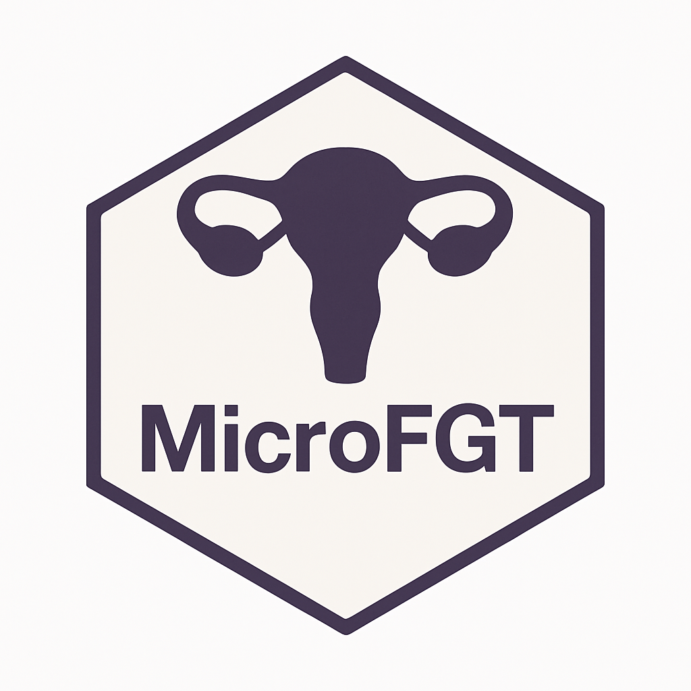

# microFGT



[](https://opensource.org/licenses/MIT)
[](https://lifecycle.r-lib.org/articles/stages.html#experimental)

A flexible, tunable, **one-stop** tool for **female genital tract (FGT) microbiome
analysis**. It runs the standard FGT tools (speciateIT, VALENCIA, VIRGO) or reimplements
their concepts, and lets method choices across the whole workflow be explored — vs. the
existing tools, which are rigid, hard to install, and frustrating to use.

> ⚠️ **This is an experimental branch (`design/fgt-workflow-map`): a ground-up Python
> rebuild of microFGT.** It is **not** the R package on `main`. The original R/S4 package
> (`R/`, `R-new/`, the `FGTExperiment` class, the `TESTING_*`/`INTEGRATION_*` docs) is being
> retired and replaced by the Python tool under [`microfgt/`](microfgt/). If you want the
> previous R package, switch to the `main` branch. The design reasoning behind the rebuild
> is in [`design/`](design/).

## What it is

The Python rebuild is built to two hard constraints: **user-friendliness** (one-command
install, a turnkey CLI, and the tool owns all the glue) and **scientific soundness**
(every method validated against a ground-truth reference before it's trusted —
compositional correctness, reproducible runs, honest sample reconciliation).

It models two arms — amplicon **16S**
(`primer-trim → denoise → assign taxonomy → import → classify CST → integrate`) and shotgun
**metagenomics** (`fastp → host removal → VIRGO2 → VISTA/mgCST → integrate`) — as stage
graphs in one registry, and the **entry point is just whichever inputs your config
provides**: paired FASTQs run the full chain, an ASV table (16S) or a compiled VIRGO2 matrix
(shotgun) enters partway, existing tool outputs enter at import. The output is one `.h5mu`
(MuData) holding sample-keyed assays plus CST/mgCST and analysis results.

## Install

Two things are needed: the **conda environment** (the tools — you own this) and, for the 16S
arm, the **speciateIT binary + a vSpeciateDB model** (`microfgt setup` owns this).

### 16S (amplicon)

```bash
# 1. Environment — lean 16S-only env (cutadapt + DADA2), then the package.
conda env create -f environment-16s.yml     # or: mamba env create -f environment-16s.yml
conda activate microfgt-16s
pip install -e ".[dev]"                      # package + Python deps (single-sourced in pyproject.toml)

# 2. Taxonomy tool + reference model — speciateIT + the vSpeciateDB model for your region.
microfgt setup --region V3V4 --dest ~/microfgt-refdata
```

`microfgt setup` clones the speciateIT `classify` binary, downloads and checksum-verifies the
vSpeciateDB model for `--region` (`V1V3 | V1V9 | V3V4 | V4V4`; `V4` aliases `V4V4`), and writes a
ready-to-run `microfgt-16s.yaml` under `--dest`. It finishes by running the ground-truth
classifier test and `microfgt check`, so you know the install works before you point it at data.

> **Note (paths with spaces):** speciateIT's `classify` breaks on spaces in a path, and conda
> won't create an env under a spaced prefix. On a machine whose home dir has a space (e.g.
> `/Users/First Last/`), give `--dest` a space-free location and create the env at a space-free
> prefix: `conda env create -f environment-16s.yml -p /Users/Shared/microfgt-16s` (then
> `conda activate /Users/Shared/microfgt-16s`). `microfgt setup` warns when `--dest` has a space.

### Full stack (16S + shotgun/VISTA)

```bash
conda env create -f environment.yml && conda activate microfgt && pip install -e ".[dev]"
```

> ⚠️ The full `environment.yml` does **not** solve on Apple Silicon — VISTA's `r-randomforestsrc`
> has no `osx-arm64` build. On an arm64 Mac, use the lean 16S env above; the shotgun arm needs an
> `osx-64` (Rosetta) env or a Linux host.

## Quickstart

```bash
# After `microfgt setup` (16S) — it already wrote and checked this config for you:
microfgt run -c ~/microfgt-refdata/microfgt-16s.yaml     # runs the bundled self-test end-to-end

# On your own data — check first, then run:
microfgt check -c config.yaml                  # preflight: are the needed tools/paths present?
microfgt run   -c config.yaml -o out.h5mu      # import → CST → analysis → one .h5mu
```

The config setup writes points at the bundled `test.fasta` self-test; swap its `asv_seqs`/
`asv_table` lines for your own data, or add a `reads: {fastq_dir, primers}` block to run from raw
FASTQs. Copy-and-run example configs, one per mode:
[`example_16s_config.yaml`](example_16s_config.yaml) (runnable against the repo fixtures),
[`example_metagenomics_config.yaml`](example_metagenomics_config.yaml), and
[`example_combined_config.yaml`](example_combined_config.yaml).

## 📖 Full documentation

**[`microfgt/README.md`](microfgt/README.md) is the source of truth** — the CLI surface,
the Python API, the build status by phase, and (importantly) an honest account of what is
**validated against real tool output** vs. what is currently **wired and tested only
against stubs**. Read it before trusting a result.

## Contributing

Contributions are welcome — see the [Contributing Guidelines](CONTRIBUTING.md).

## License

MIT — see the [LICENSE](LICENSE) file.

## Citation

If you use microFGT in your research, please cite:

```
Handley, S. (2023-2025). microFGT: Comprehensive Analysis of Female Genital Tract
Microbiome Data. GitHub repository, https://github.com/shandley/microFGT
```
