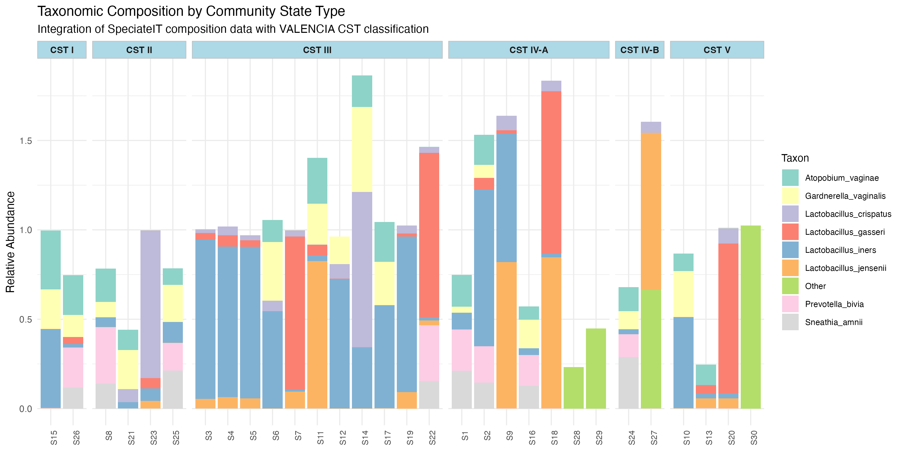
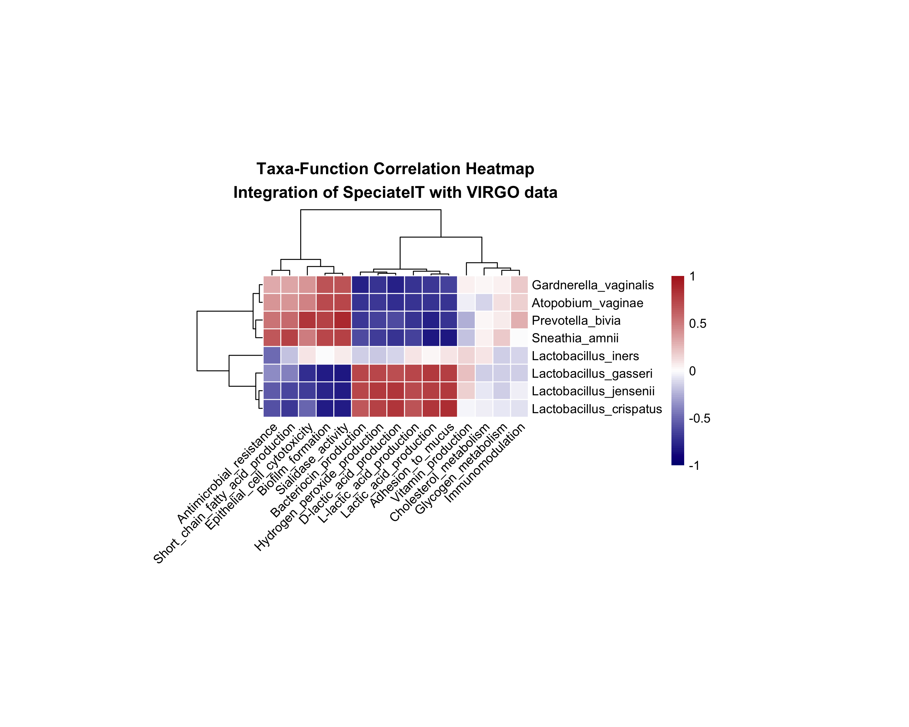
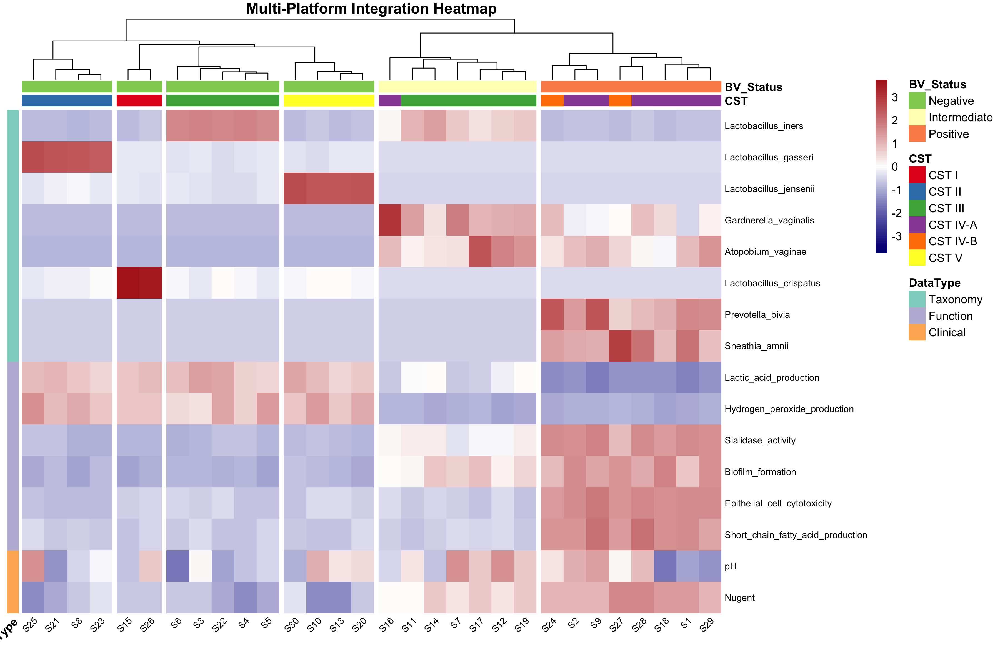
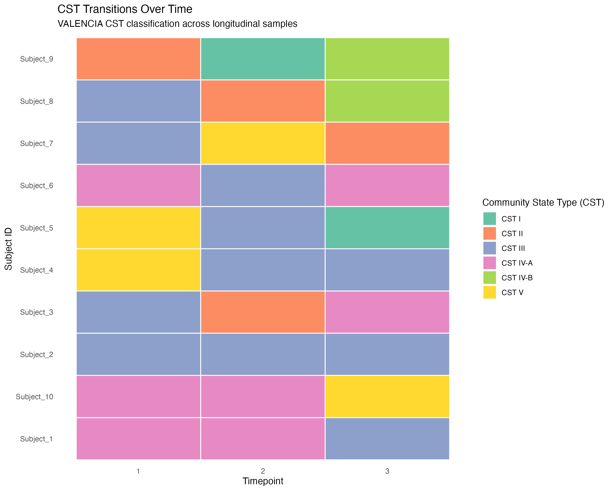
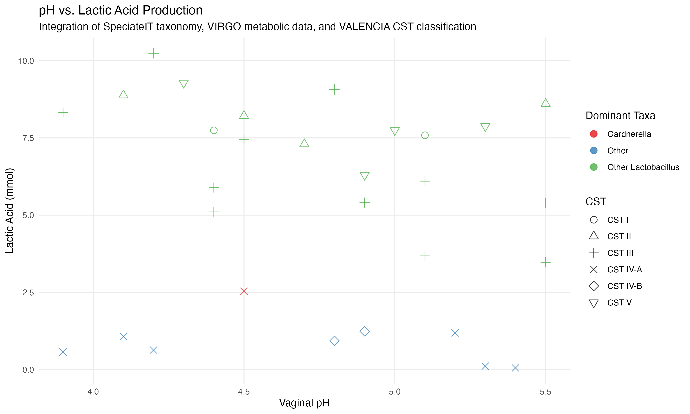
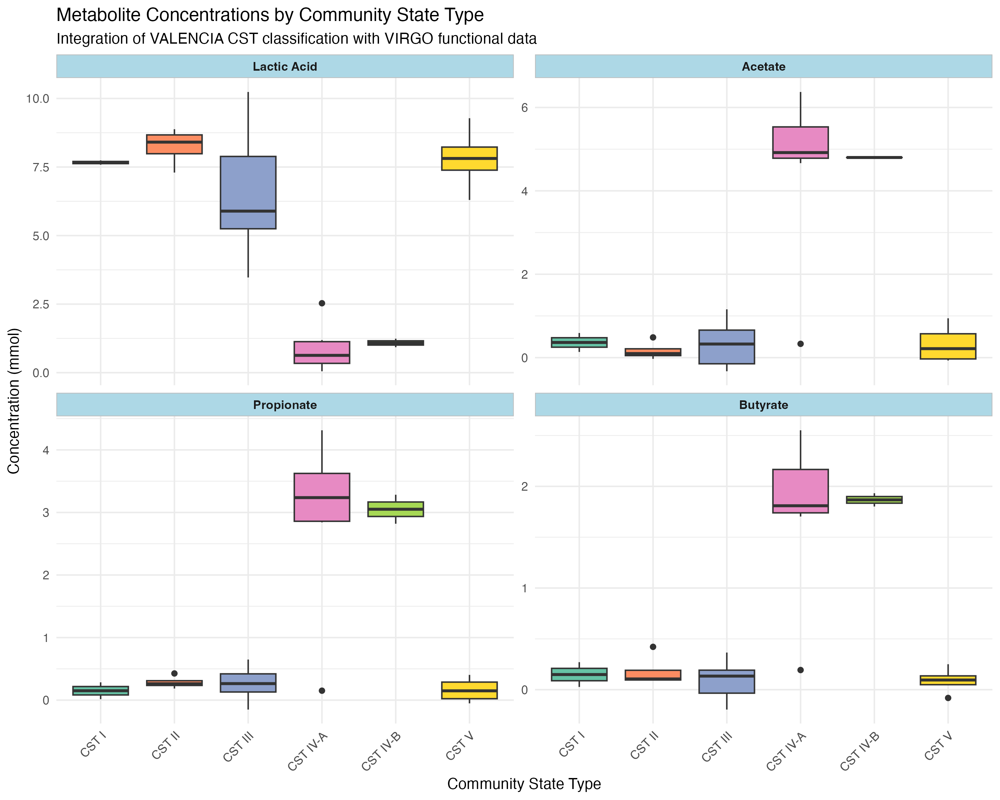
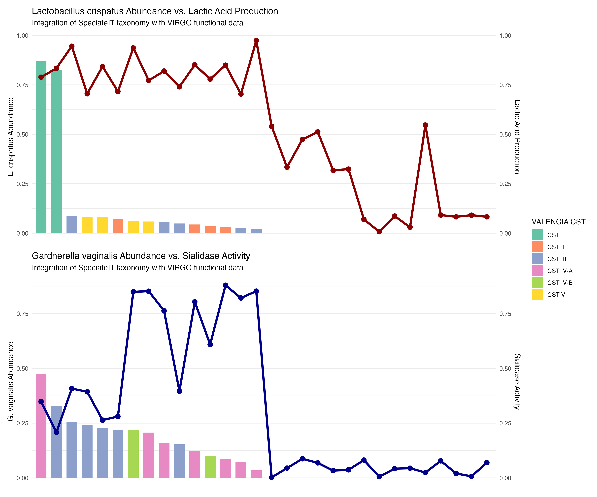

# Platform Integration Visualizations

This directory contains visualizations that demonstrate the integration capabilities of the microFGT package, showing how data from SpeciateIT, VALENCIA, and VIRGO can be combined for comprehensive analysis.

## Multi-Platform Integration

**Description**: This stacked bar chart shows the taxonomic composition of samples organized by Community State Type (CST). It integrates SpeciateIT taxonomic abundance data with VALENCIA CST classifications, demonstrating how microFGT can combine information from multiple platforms to create more informative visualizations.

## Correlation Heatmap

**Description**: This heatmap shows correlations between taxonomic abundances (from SpeciateIT) and functional profiles (from VIRGO). Red indicates positive correlations, blue indicates negative correlations. This visualization helps identify which microbial taxa are associated with specific functional capabilities, bridging the gap between community composition and metabolic potential.

## Integration Heatmap

**Description**: A comprehensive heatmap that integrates multiple data types: taxonomic abundances from SpeciateIT, functional profiles from VIRGO, and clinical measurements. Samples are clustered based on similarities across all these data types, and annotations show CST classifications and BV status. This visualization demonstrates microFGT's ability to create holistic views of the microbiome that incorporate diverse data types.

## CST Transitions Over Time

**Description**: This plot shows Community State Type (CST) transitions for different subjects over time, based on VALENCIA classifications. Each row represents a subject, and each column represents a timepoint. The color indicates the CST at that timepoint. This visualization helps identify patterns of stability or volatility in vaginal microbiome communities.

## pH vs. Lactobacillus Correlation

**Description**: This scatter plot shows the relationship between vaginal pH (a clinical measurement) and lactic acid production (from VIRGO functional data), with points colored by dominant taxa (from SpeciateIT) and shaped by CST (from VALENCIA). This multi-platform integration helps understand how microbial composition relates to both metabolic function and clinical measurements.

## VALENCIA CST Metabolites

**Description**: This series of box plots shows the distribution of different metabolite concentrations (derived from VIRGO functional data) across different Community State Types (from VALENCIA). This visualization helps identify metabolic signatures associated with different CSTs, connecting community structure to metabolic output.

## VIRGO Gardnerella and Lactobacillus Comparison

**Description**: These plots show the relationship between specific taxa and functional activities. The top panel shows Lactobacillus crispatus abundance in relation to lactic acid production, while the bottom panel shows Gardnerella vaginalis abundance in relation to sialidase activity. Bars are colored by CST. This visualization integrates taxonomic data from SpeciateIT, functional data from VIRGO, and CST classifications from VALENCIA to provide insights into structure-function relationships in the vaginal microbiome.

## Integration Value

The microFGT package facilitates these types of integrative analyses through:

1. **Standardized Data Structures**: A common framework for handling diverse data types
2. **Unified Metadata Handling**: Allows cross-referencing between different data platforms 
3. **Integrated Visualization Functions**: Specialized plotting functions designed for multi-platform integration
4. **Comprehensive Analysis Methods**: Statistical approaches that leverage data from multiple sources

These capabilities enable researchers to gain more comprehensive insights into the female genital tract microbiome than would be possible when analyzing data from each platform separately.