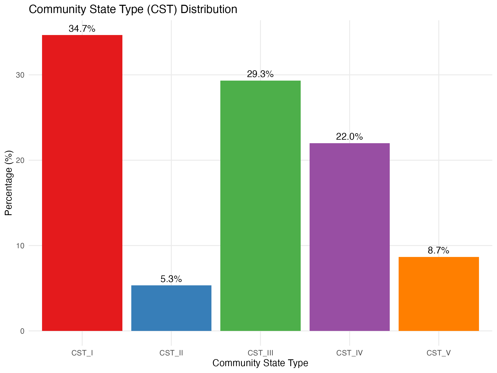
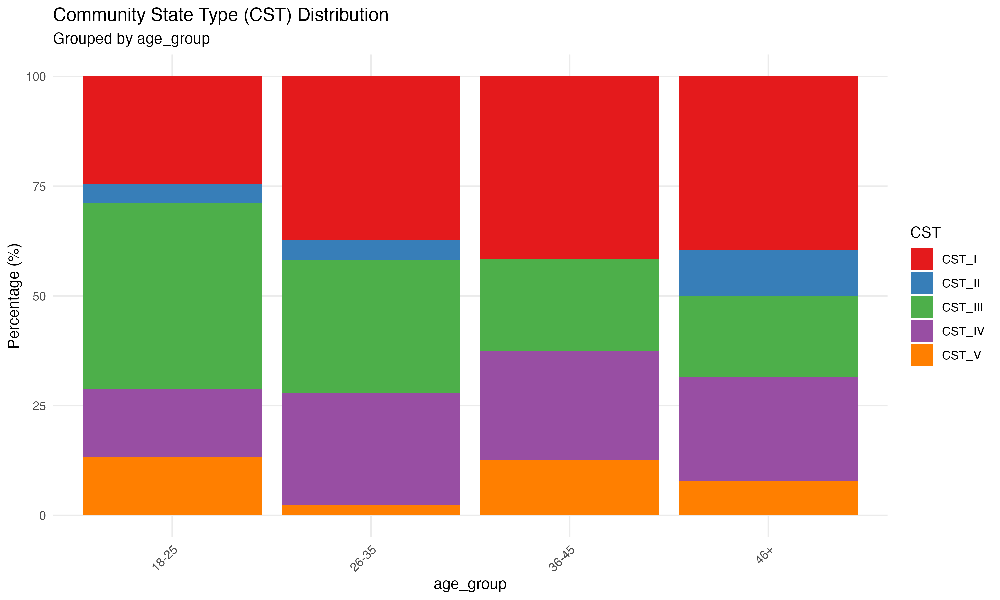
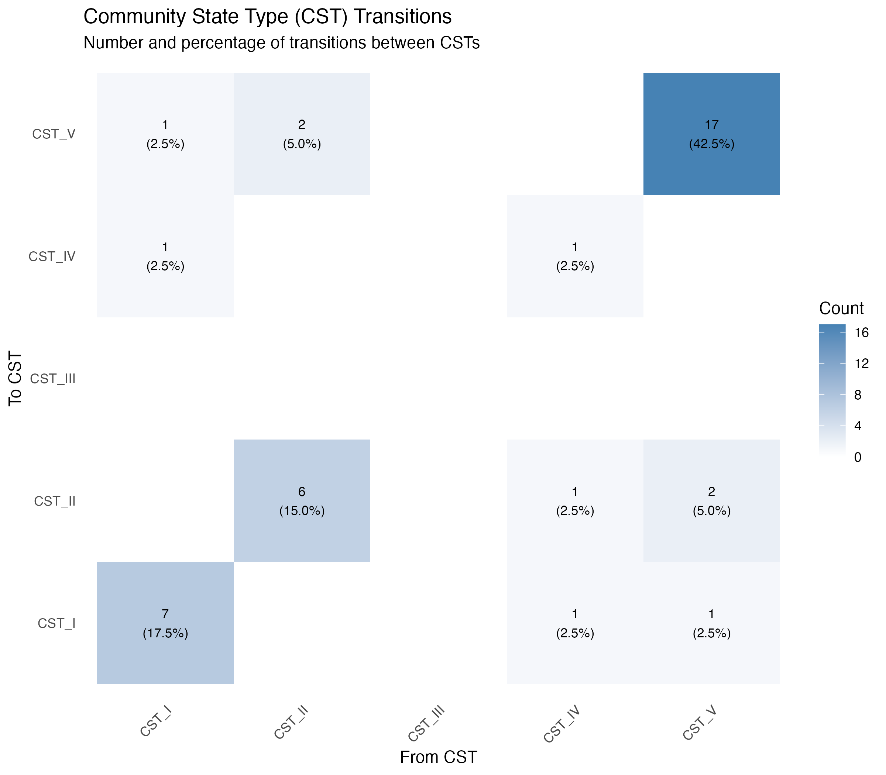
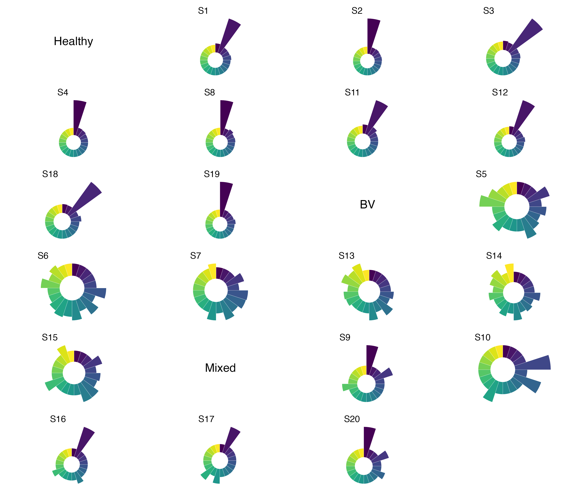
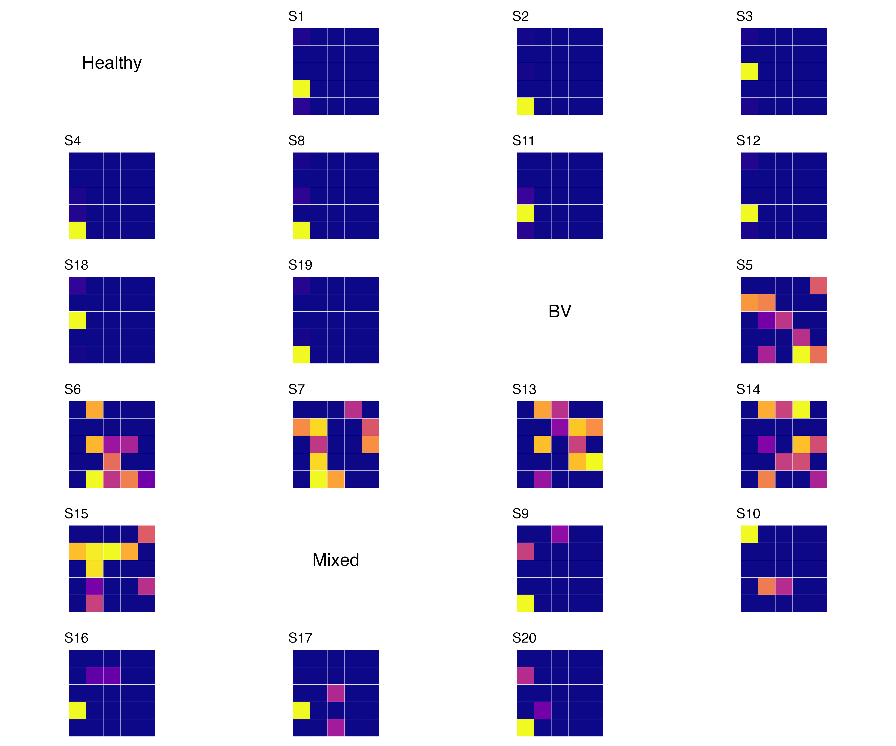
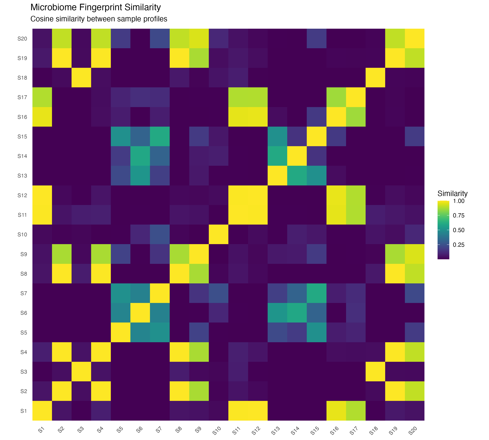
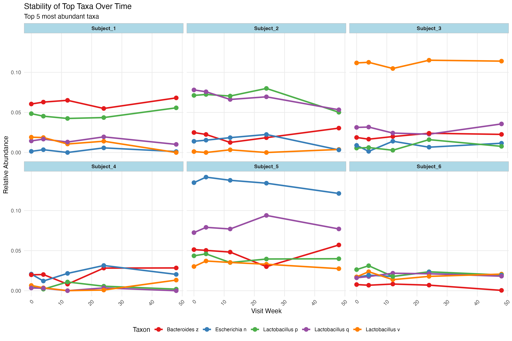
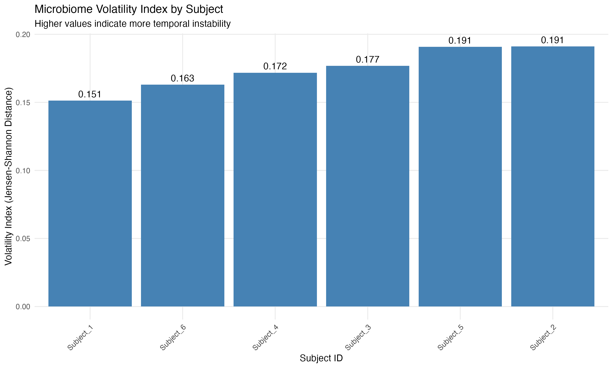
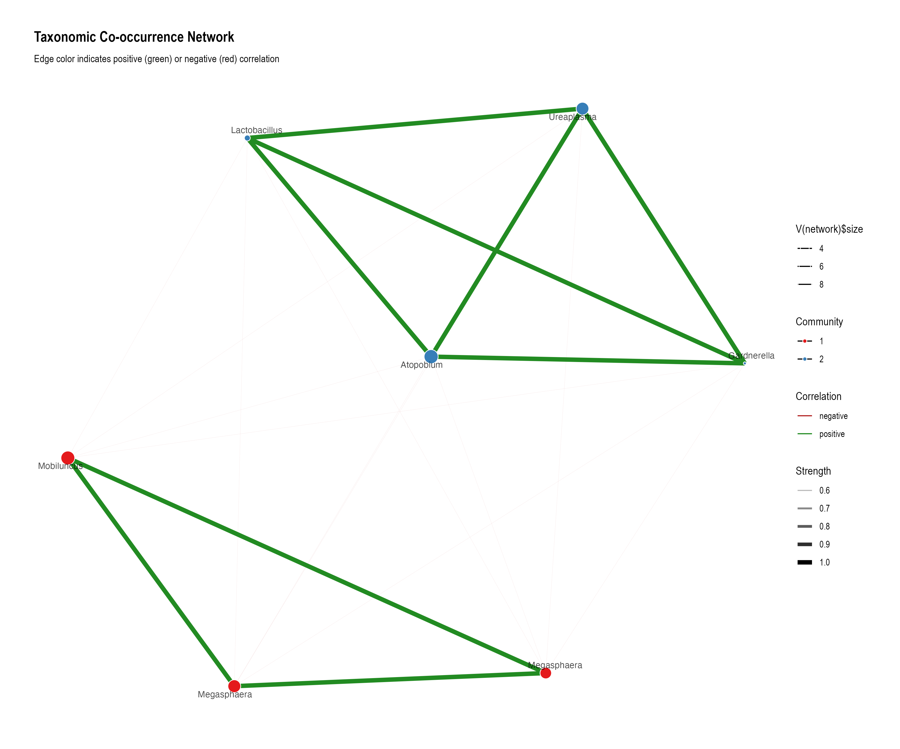
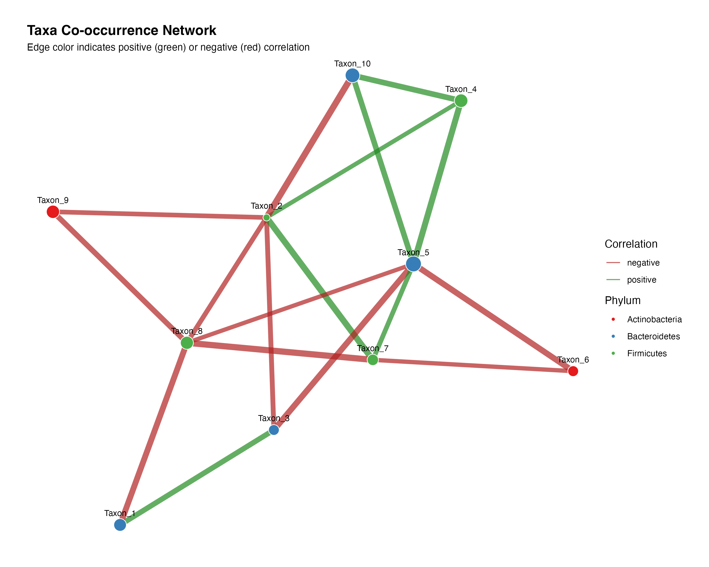

# microFGT Visualization Examples

This document provides explanations for the visualization examples created with the microFGT package.

## Community State Type (CST) Visualizations

### CST Distribution

**Description**: This plot shows the overall distribution of Community State Types (CSTs) across all samples. The y-axis represents the percentage of samples that belong to each CST category. CSTs are important in female genital tract microbiome research, as they represent common microbial community patterns associated with different health states.

- **CST I**: Dominated by *Lactobacillus crispatus*
- **CST II**: Dominated by *Lactobacillus gasseri*
- **CST III**: Dominated by *Lactobacillus iners*
- **CST IV**: Diverse community with various anaerobic bacteria
- **CST V**: Dominated by *Lactobacillus jensenii*

### CST by Age Group

**Description**: This stacked bar chart shows the distribution of CSTs across different age groups. This visualization helps identify potential age-related patterns in microbiome composition. Each color represents a different CST, and the height of each colored segment indicates the percentage of samples within that age group belonging to a particular CST.

### CST Transitions

**Description**: This heatmap visualizes transitions between different CSTs over time. The x-axis shows the "From" CST state, while the y-axis shows the "To" CST state. The color intensity indicates the frequency of transitions, with darker blue representing more common transitions. This visualization is particularly valuable for longitudinal studies, as it helps identify common patterns of community state changes.

## Microbiome Fingerprint Visualizations

### Microbiome Fingerprints (Circular)

**Description**: These circular visualizations represent unique "fingerprints" for individual microbiome samples. Each segment of the circle represents a different taxon, with the segment width corresponding to the taxon's relative abundance. These fingerprints allow for quick visual identification and comparison of microbial community structures across samples, grouped by health status or other metadata categories.

### Microbiome Fingerprints (Heatmap)

**Description**: An alternative representation of microbiome fingerprints using a heatmap approach. Each square grid represents a sample's microbiome profile, with the color intensity of each cell representing the abundance of different taxa. This visualization offers a more compact representation that allows for comparison of many samples simultaneously.

### Fingerprint Similarity

**Description**: This heatmap shows the similarity between different microbiome samples. Each cell in the matrix represents the cosine similarity between two samples, with darker colors indicating higher similarity. This visualization helps identify clusters of similar samples and outliers with unique microbiome profiles.

## Longitudinal Analysis Visualizations

### Taxa Stability

**Description**: This multi-panel plot shows the stability of the most abundant taxa over time for different subjects. Each line represents a different taxon, and the y-axis shows relative abundance. These plots help identify patterns of microbiome stability or volatility within individuals over time, as well as taxa that consistently dominate or fluctuate.

### Volatility Index

**Description**: This bar chart shows the microbiome volatility index for each subject, calculated as the average Jensen-Shannon distance between consecutive timepoints. Higher values indicate greater temporal instability in the microbiome. This metric provides a quantitative measure of how much a subject's microbiome composition changes over time.

## Taxonomic Network Visualizations

### Taxa Network

**Description**: This network visualization shows relationships between different taxa based on co-occurrence patterns. Nodes represent taxa, with node size indicating abundance. Edges connect taxa that frequently co-occur (green) or show negative associations (red). This network helps identify microbial associations and potential ecological relationships within the microbiome.

### Taxa Network (Circular)

**Description**: An alternative circular layout of the taxonomic co-occurrence network, which sometimes makes community structures more apparent. The circular arrangement can highlight groups of taxa that tend to co-occur together.

### Taxa Network (Simple)

**Description**: A simplified network visualization that focuses on the strongest correlations between taxa. This representation prioritizes clarity and interpretability over showing all possible connections, making key ecological relationships more apparent.

## Usage in Research

These visualizations serve multiple purposes in female genital tract microbiome research:

1. **Pattern Discovery**: Identifying common patterns and associations within microbiome data
2. **Subject Comparison**: Comparing microbiome profiles across different subjects or groups
3. **Temporal Analysis**: Tracking changes in microbiome composition over time
4. **Community Structure**: Understanding the complex ecological relationships between different microbes
5. **Metadata Integration**: Correlating microbiome patterns with clinical or demographic data

The microFGT package provides tools to generate these visualizations with real microbiome data, supporting both amplicon sequencing and metagenomic data analysis.